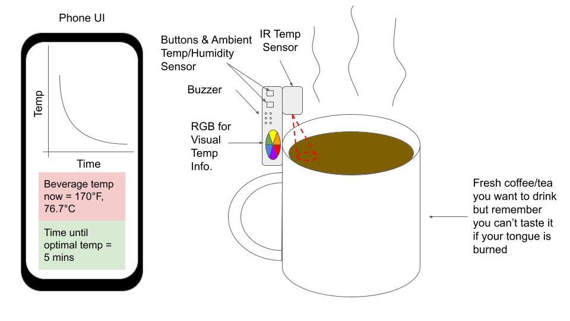
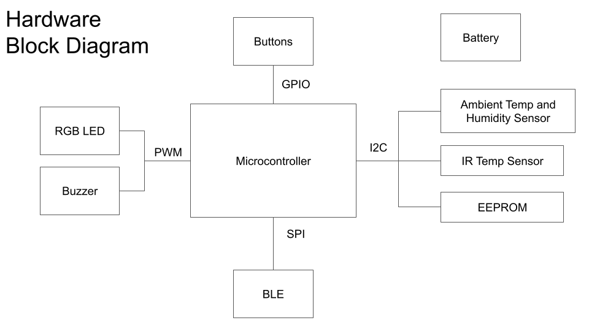

# Hot Beverage Temperature Monitor
## Overview
I love drinking warm drinks like tea and coffee but they're often prepared too hot to drink immediately. Depending on the container I am using (e.g. insulated) and the environment, it can take many minutes for the beverage to reach a preferred and safe drinking temperature. While I'm waiting I usually get side-tracked, causing my drink to cool down by the time I remember to check on it. 

The purpose of this embedded device is to clip on to your cup or bottle, monitor the beverage temperature, and let you know when your beverage is ready for drinking either through your phone or its buzzer or RGB LED.

## Hardware Block Diagram

## Software Block Diagram
