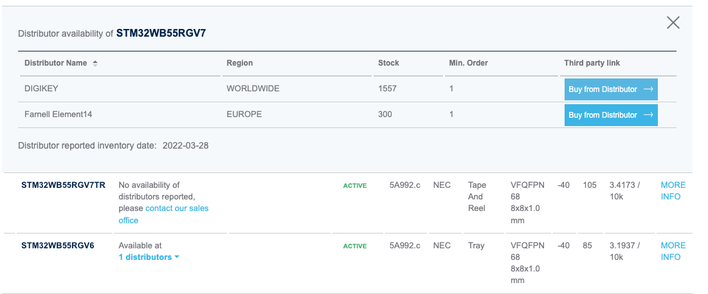
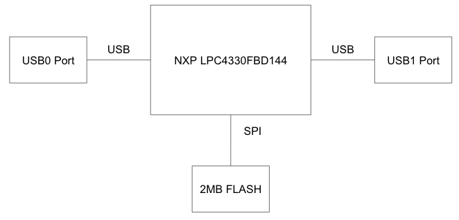
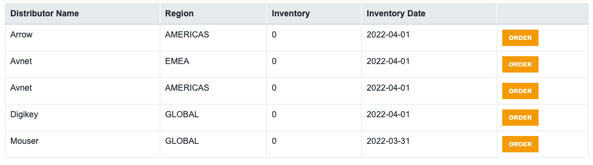

# Project Board
## Board Questions
- What kind of processor is it?
    - The processor is the STM32WB55RG. It contains a dual core 32-bit architecture: an Arm Cortex M4 and M0+ for real time radio layer.
- How much Flash and RAM does it have? Any other memory types?
    - The STM32WB55RG has 1MB of Flash memory and 256kB of SRAM. There is also 1kB of OTP memory. 
- Does it have any special peripherals?
    -   * Inter processor communication controller for Bluetooth
        * USB
        * 12-bit ADC
        * USART
        * SAI
        * LCD controller
        * Touch sensing controller
- If it has an ADC, what are the features?
    - 12-bit ADC 4.26 Msps, up to 16-bit with hardware oversampling, 200 µA/Msps
- How much does the board cost vs what the processor costs? Is the processor in stock anywhere?
    - 
At the time of writing (04/01/2022), the processor is readily available and the price for bulk orders is:

    
    - On DigiKey a single processor costs $12.48.
- Is there an application note?
    - STM offers several [application notes](https://www.st.com/en/microcontrollers-microprocessors/stm32wb55rg.html#). For example, [this](https://www.st.com/resource/en/application_note/an5289-building-wireless-applications-with-stm32wb-series-microcontrollers-stmicroelectronics.pdf) one is about building wireless applications with STM32WB microcontrollers, which will be usefull for applying BLE to my project. 
    
# Assigned Board : GreatFET One

## Hardware Block Diagram

The hardware block diagram is simple since the board was designed to add USB interfacing to expansions boards. 

## Board Questions

- What kind of processor is it?
    - The GreatFET One is equipped with the NXP LPC4330FBD144 microcontroller. Within the microcontroller is a ARM Cortex-M4 core processor and an ARM Cortex-M0 coprocessor. 
- How much Flash and RAM does it have? Any other memory types?
    - The LPC4330 MCU actually has 264 kB SRAM for code and data use. There is 64kB ROM that contains boot code and on-chip software drivers. However, there is no onboard flash memory and that is why the GreatFET One board has 2MB of SPI flash.
- Does it have any special peripherals?
    -   * Ethernet
        * Two USB ports (host/device)
        * 8 ADC channels
        * Motor control PWM
        * 83 GPIOs
- If it has an ADC, what are the features?
    - Two 10-bit ADCs with DMA support and a data conversion rate of 400 kSamples/s. Up to eight input channels per ADC.
- How much does the board cost vs what the processor costs? Is the processor in stock anywhere?
    - 
At the time of writing (04/01/2022), the processor is not in stock anywhere:

    
    - The unit price for a single processor from DigiKey is $14.32.
    - The board is available from several distributors at different prices. For example, on [SparkFun](https://www.sparkfun.com/products/16267) it is $114.95 whereas on [Adafruit](https://www.adafruit.com/product/4234) it is $99.95. The full list of purchasing options can be found [here](https://greatscottgadgets.com/greatfet/one/).
- Is there an application note?
    - NXP offeres several [application notes](https://www.nxp.com/products/processors-and-microcontrollers/arm-microcontrollers/general-purpose-mcus/lpc4300-cortex-m4-m0/dual-core-cortex-m4-m0-264-kb-sram-2-hs-usb-with-on-chip-phy-ethernet-can-aes-spifi-sgpio-sct:LPC4330FBD144?&tab=Documentation_Tab&linkline=Application-Note). For example, [this](https://www.nxp.com/docs/en/application-note/AN11508.pdf) one is for using the processor's External Memory Controller (EMC).