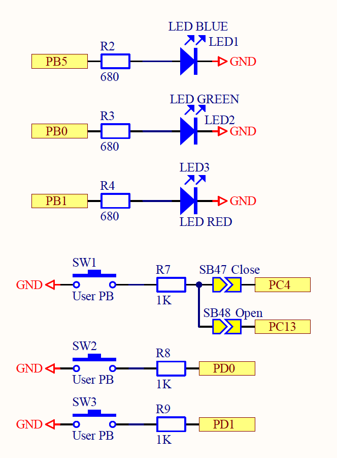
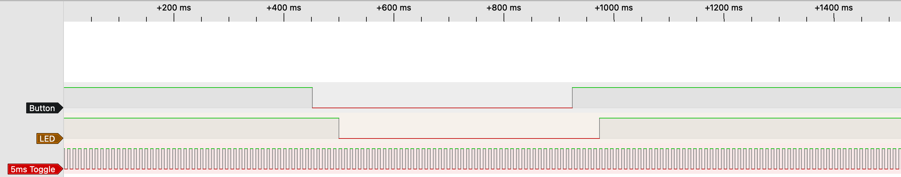
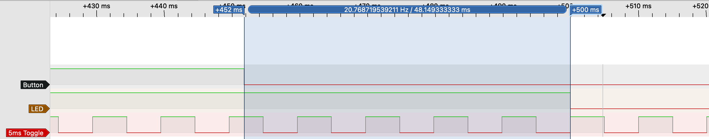
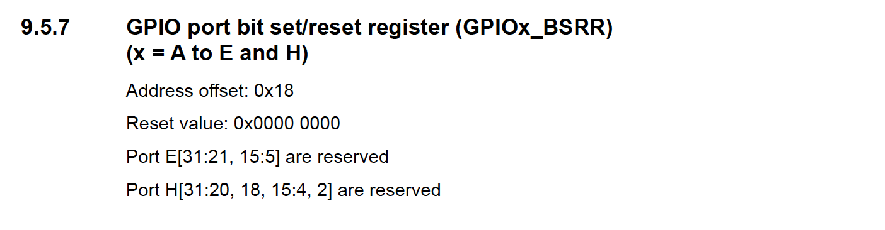
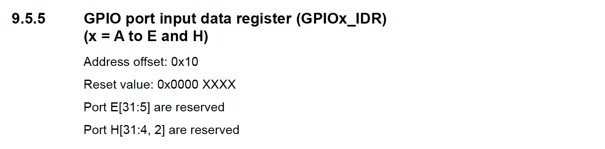
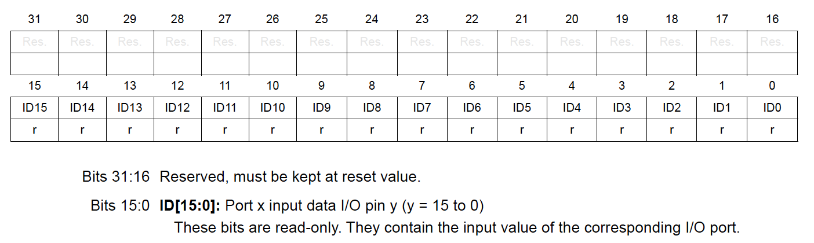
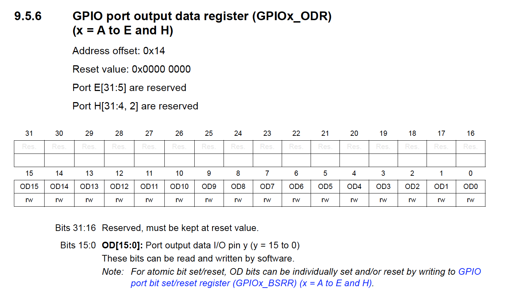
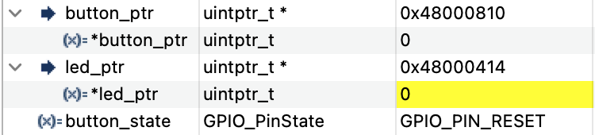
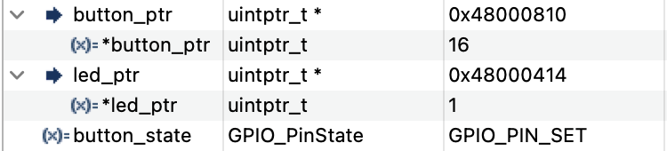

# Make Blinky
For this program, The NUCLEO-WB55RG board (STM32WB55RGV6U MCU) was used. LED LED2 and button SW1 were used for the output and input respectively. 

## Button and LED Behavior
The button is debounced by a timer ISR that triggers every 5ms and waits for 10 consecutive button samples that match the current debounced button state.

Here is an example of the button and LED behavior for a press and release event.

Here is a zoomed in capture of the press event. The logic analyzer did not capture button bounces, but you can see the timer ISR in action, waiting approximately 50ms before being confident that the button state has changed.

## Assignment Questions
- What are the hardware registers that cause the LED to turn on and off? (From the processor manual, don’t worry about initialization.)
    - Pin PB0 drives the LED. Aside from the GPIO configuration registers for setting up an output in push/pull mode, the particular hardware register that causes the LED to turn off and on is the GPIOB_BSRR register.   
    
     
- What are the registers that you read in order to find out the state of the button?
    - Pin PC4 is connected to SW1. Aside from the GPIO configuration registers for setting up an input with an internal pull-up enabled, the particular hardware register that is read to determine the state of the button is the GPIOC_IDR register.
    
     
- Can you read the register directly and see the button change in a debugger or by printing out the value of the memory at the register’s address?
    - Although GPIOB_BSRR is used for setting the output, reading the register always returns 0x0000. An alternative register to read to check the LED output is GPIOB_ODR.
    
    GPIOC_IDR is memory mapped to 0x48000810 and GPIOB_ODR is memory mapped to 0x48000414. We can see how they change state together using the STM32CubeIDE debugger.
        - Switch pressed:
        
        - Switch released:
        