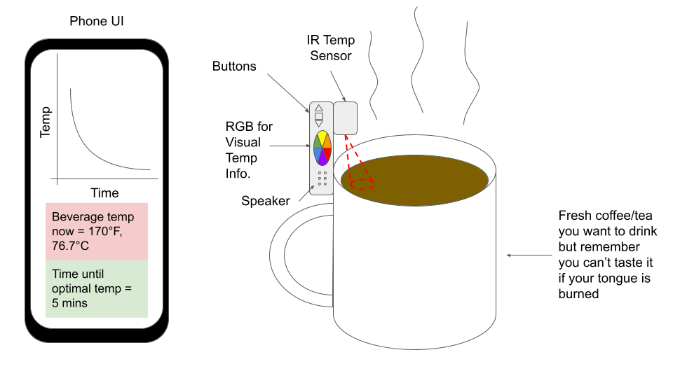
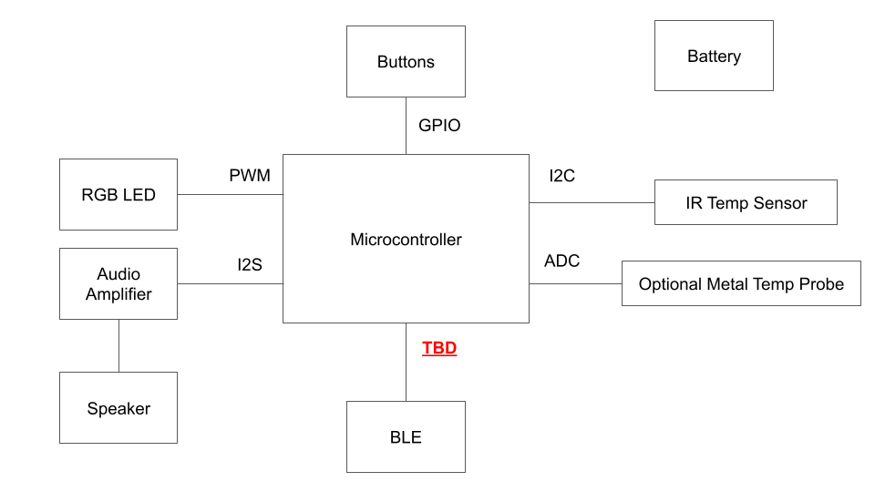
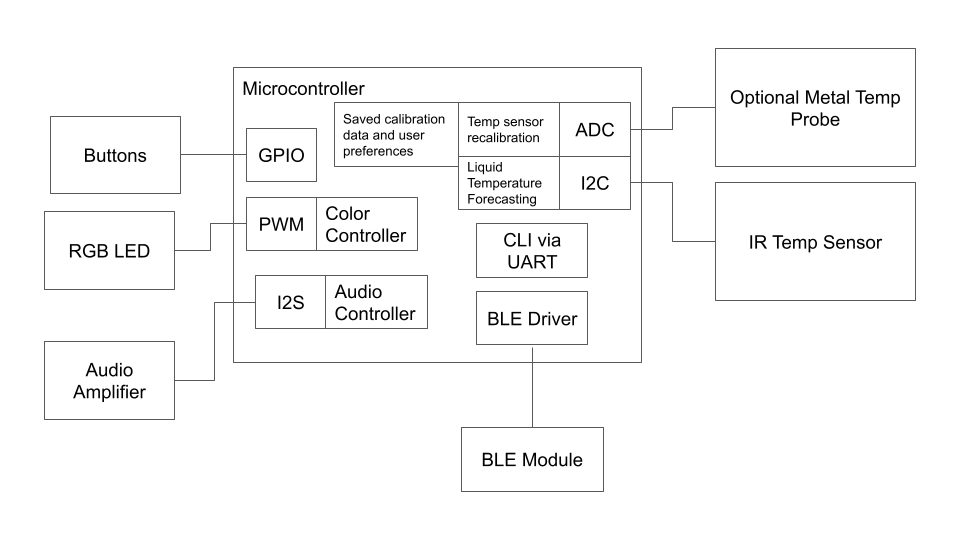
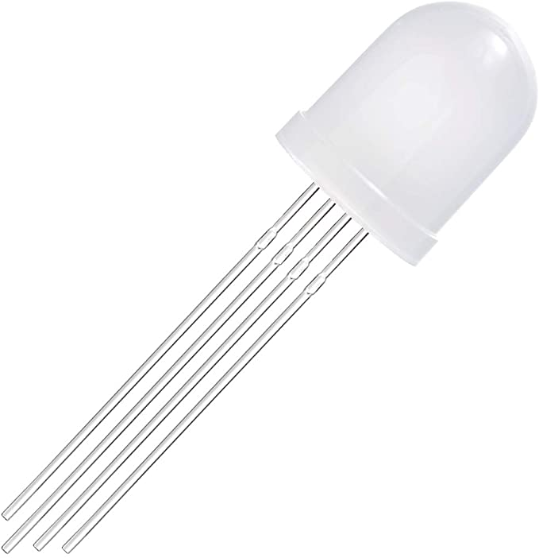
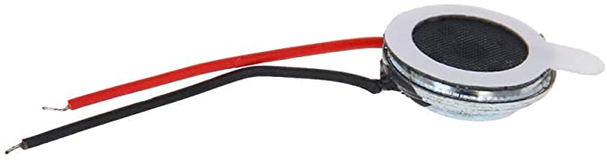
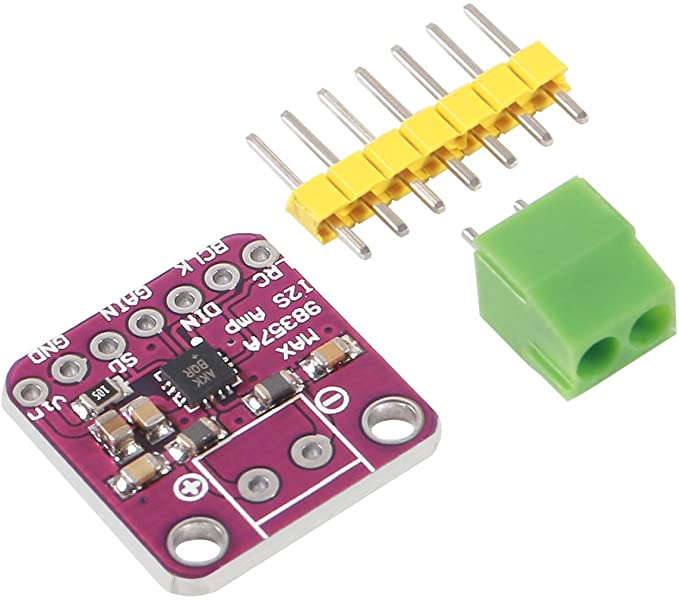
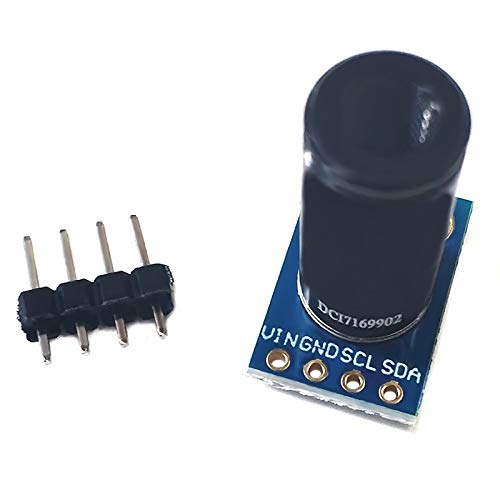

# Remote Beverage Temperature Monitor: Project Report (Draft)

## Application
I love drinking warm drinks like tea and coffee but they're often prepared too hot to drink immediately. Depending on the container I am using (e.g. insulated) and the environment, it can take many minutes for the beverage to reach a preferred and safe drinking temperature. While I'm waiting I usually get side-tracked, causing my drink to cool down by the time I remember to check on it. 

The purpose of this embedded device is to clip on to your cup or bottle, monitor the beverage temperature, and let you know when your beverage is ready for drinking either through your phone, its buzzer or its RGB LED.

## Architecture

### Hardware Block Diagram

### Software Diagrams
### Software Block Diagram

### Software Hierarchy of Control
TBD
### Software Layered Block Diagram
TBD
## Hardware
* MCU EVB - STM32WB55RG MCU on the NUCLEO-WB55RG STM32 Nucleo-64 EVB
    * EVB has RF transceiver for BLUE

    
* 10mm RGB LED - 50F10W-YT-RGB-CC [Amazon](https://www.amazon.com/dp/B01CI6EWHK?psc=1&ref=ppx_yo2ov_dt_b_product_details)

* Speaker - 
Fielect Magnetic Speaker 0.5W 8 Ohm 10mm Diameter Round Shape Replacement Loudspeaker [Amazon](https://www.amazon.com/dp/B082762Y5W?ref=ppx_yo2ov_dt_b_product_details&th=1)

* I2S Audio Amplifier - MAX98357 [Amazon](https://www.amazon.com/dp/B0912CWB7Z?psc=1&ref=ppx_yo2ov_dt_b_product_details)

* IR Temp Sensor - MLX90614ESF DCI Non-contact Infrared IR Temperature Sensor Module with 5 degree FoV [Ebay](https://www.ebay.com/itm/193998035974)

* Metal Temp Probe - Vernier Stainless Steel Temperature Probe [Vernier](https://www.vernier.com/product/stainless-steel-temperature-probe/)

## Software
### State Machine

## Build Instructions
### Hardware Requirements
* EVB has on-board ST-LINK/V2-1 debugger/programmer
### Software Requirements
* STM32CubeIDE 
### Debugging
* STM32CubeIDE and on-board ST-LINK/V2-1 debugger
* [sigrok](https://sigrok.org/wiki/Main_Page) logic analyzer software using cheap, [$10 logic analyzer](https://sigrok.org/wiki/ARMFLY_Mini-Logic)
* DMM

### Powering the System
Currently the system is powered via the EVB's USB interface, but eventually that will be replaced with a rechargable battery.

## Future Work
### Preparing for production
TBD
### Additional Modules or Features
TBD
